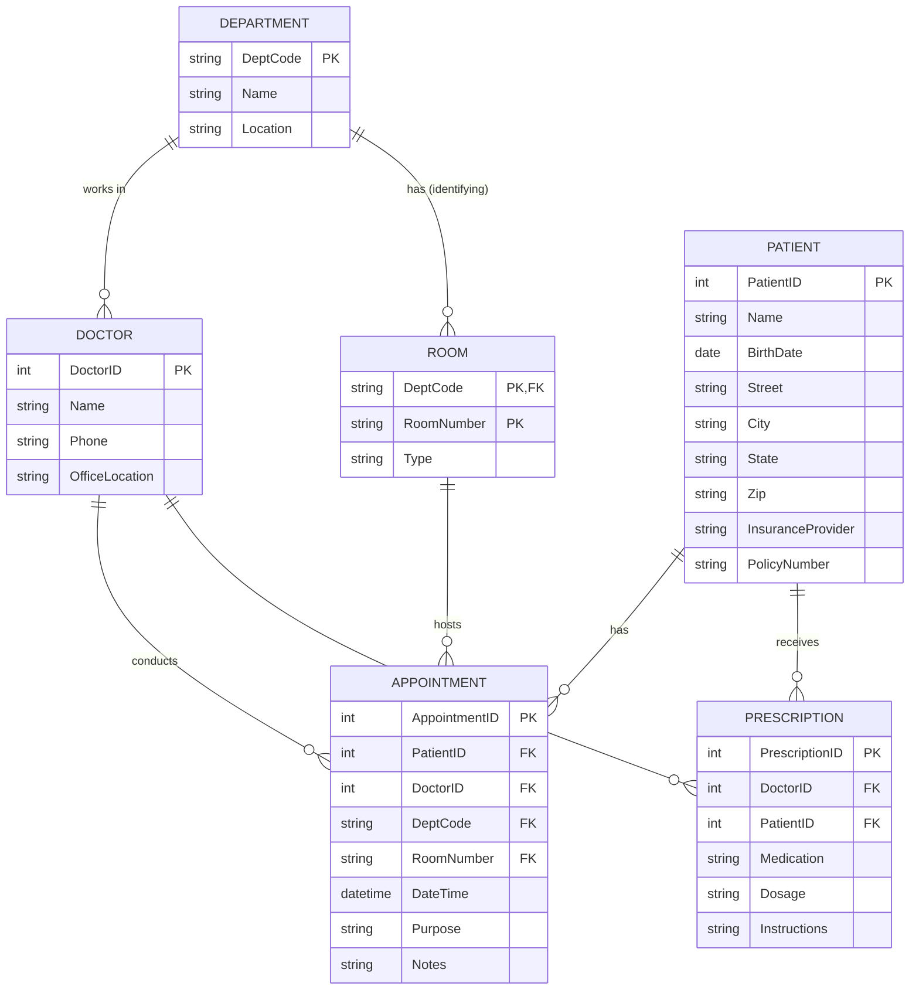

# Task 2.1 — Hospital Management System

## 1. Сущности (Entities)

| Сущность | Тип | Обоснование |
|---|---|---|
| **Patient** | Strong | имеет собственный уникальный `PatientID` |
| **Doctor** | Strong | имеет собственный уникальный `DoctorID` |
| **Department** | Strong | имеет собственный уникальный `DeptCode` |
| **Appointment** | Strong | имеет собственный `AppointmentID`, существует как отдельная запись |
| **Prescription** | Strong | имеет собственный `PrescriptionID` |
| **Room** | **Weak** | номер комнаты уникален только **внутри отделения** (room 101 в Cardiology ≠ room 101 в Neurology) → owner-сущность **Department**, partial key = `RoomNumber`, полный ключ = `(DeptCode, RoomNumber)` |

## 2. Атрибуты

**Patient**
- `PatientID` — simple, PK
- `Name` — simple
- `BirthDate` — simple
- `Address` — **composite** (Street, City, State, Zip)
- `Age` — **derived** (из BirthDate)
- `PhoneNumbers` — **multivalued**
- `InsuranceInfo` — composite (Provider, PolicyNumber)

**Doctor**
- `DoctorID` — simple, PK
- `Name` — simple
- `Specializations` — **multivalued**
- `Phone` — simple
- `OfficeLocation` — simple

**Department**
- `DeptCode` — simple, PK
- `Name` — simple
- `Location` — simple

**Room** (weak)
- `RoomNumber` — partial key
- `Capacity`/`Type` — simple (по необходимости)

**Appointment**
- `AppointmentID` — simple, PK
- `DateTime` — simple
- `Purpose` — simple
- `Notes` — simple

**Prescription**
- `PrescriptionID` — simple, PK
- `Medication` — simple
- `Dosage` — simple
- `Instructions` — simple

## 3. Связи и кардинальность

| Связь | Кардинальность | Участие |
|---|---|---|
| `Doctor` — WORKS_IN — `Department` | N:1 | total на Doctor (допущение: каждый врач закреплён за одним отделением) |
| `Room` — LOCATED_IN — `Department` (идентифицирующая) | 1:N | total на Room (weak entity) |
| `Patient` — HAS — `Appointment` | 1:N | total на Appointment, partial на Patient |
| `Doctor` — CONDUCTS — `Appointment` | 1:N | total на Appointment, partial на Doctor |
| `Doctor` — WRITES — `Prescription` | 1:N | partial на Doctor |
| `Patient` — RECEIVES — `Prescription` | 1:N | partial на Patient |
| `Appointment` — HELD_IN — `Room` | N:1 | partial (опционально) |

> Допущение: `Prescription` привязан к конкретному `Doctor` и `Patient` напрямую (а не через Appointment) — это отдельная M:N связь Doctor↔Patient, реализованная через сущность Prescription с собственными атрибутами (classic "associative entity").

## 4. ER-диаграмма (Mermaid)

## 5. Primary Keys — итог

- `Patient(PatientID)`
- `Doctor(DoctorID)`
- `Department(DeptCode)`
- `Room(DeptCode, RoomNumber)` — composite (weak entity)
- `Appointment(AppointmentID)`
- `Prescription(PrescriptionID)`

Многозначные атрибуты (`PhoneNumbers`, `Specializations`) при переводе в реляционную схему выносятся в отдельные таблицы (см. `schema.sql`).
