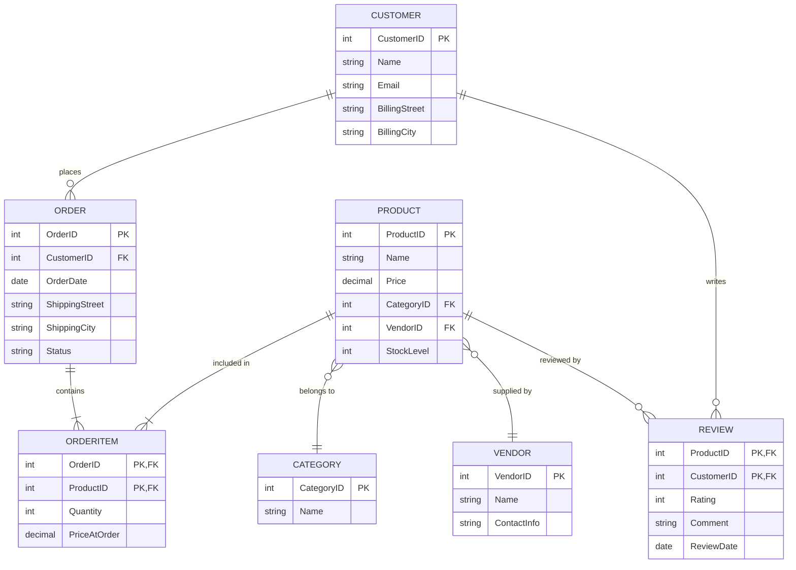

# Task 2.2 — E-commerce Platform

## 1. Сущности

| Сущность | Тип | Обоснование |
|---|---|---|
| **Customer** | Strong | `CustomerID` |
| **Order** | Strong | `OrderID` |
| **Product** | Strong | `ProductID` |
| **Category** | Strong | `CategoryID` |
| **Vendor** | Strong | `VendorID` |
| **OrderItem** | **Weak** | не имеет собственного смысла без `Order`; составной ключ `(OrderID, ProductID)` |
| **Review** | **Weak** | привязан к паре `Product`+`Customer`; составной ключ `(ProductID, CustomerID)` (допущение: один отзыв на товар от одного покупателя) |

## 2. Атрибуты

- **Customer**: `CustomerID` PK, `Name`, `Email`, `BillingAddress` (composite: Street/City/State/Zip)
- **Order**: `OrderID` PK, `OrderDate`, `ShippingAddress` (composite — может отличаться от billing), `Status`
- **Product**: `ProductID` PK, `Name`, `Price`, `Description`, `StockLevel` (учёт инвентаря как атрибут)
- **Category**: `CategoryID` PK, `Name`
- **Vendor**: `VendorID` PK, `Name`, `ContactInfo`
- **OrderItem** (weak): `OrderID` FK+PK, `ProductID` FK+PK, `Quantity`, `PriceAtOrder`
- **Review** (weak): `ProductID` FK+PK, `CustomerID` FK+PK, `Rating`, `Comment`, `ReviewDate`

## 3. Связи и кардинальность

| Связь | Кардинальность |
|---|---|
| `Customer` — PLACES — `Order` | 1:N |
| `Order` — CONTAINS — `Product` (через `OrderItem`) | **M:N** (нужны атрибуты Quantity, PriceAtOrder) |
| `Product` — BELONGS_TO — `Category` | N:1 |
| `Product` — SUPPLIED_BY — `Vendor` | N:1 (допущение: один основной вендор на товар) |
| `Customer` — WRITES — `Review` for `Product` | **M:N** (нужны атрибуты Rating, Comment) |

## 4. Weak entity — обоснование

**`OrderItem`** — классический weak entity: строка "товар в заказе" не имеет смысла без родительского `Order` (существование зависит от Order), а её partial key `ProductID` уникален только в рамках одного заказа → полный ключ `(OrderID, ProductID)`, identifying relationship с `Order` (при удалении Order удаляются и его OrderItem — `ON DELETE CASCADE`).

## 5. M:N связь с атрибутами

Помимо `OrderItem`, вторая M:N связь с атрибутами — **`Review`**: один покупатель может оставить отзывы на много товаров, у одного товара — много отзывов от разных покупателей; сама связь несёт данные (`Rating`, `Comment`, `ReviewDate`), поэтому не может быть представлена простой связью без атрибутов.

## 6. ER-диаграмма (Mermaid)

