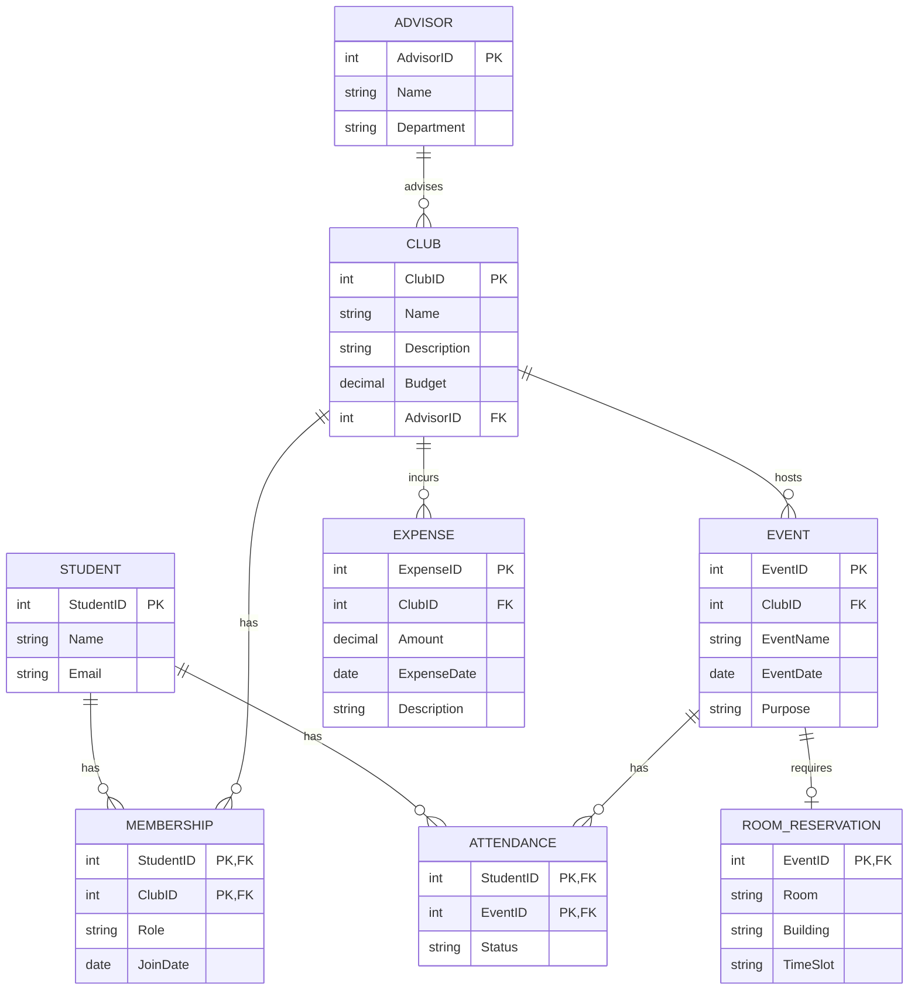

# Task 5.1 — Real-World Application: Student Clubs System

## Требования системы
- Информация о клубах и организациях
- Членство (студент может состоять в нескольких клубах, у клуба много участников)
- Мероприятия клуба и учёт посещаемости студентами
- Должности офицеров клуба (president, treasurer, secretary и т.д.)
- Факультетский советник клуба (у клуба один советник, советник может курировать несколько клубов)
- Бронирование помещений под мероприятия
- Учёт бюджета и расходов клуба

## 1. ER-диаграмма (Mermaid)



## 2. Реляционная схема (3NF)

```
Student(StudentID, Name, Email)
    PK: StudentID

Advisor(AdvisorID, Name, Department)
    PK: AdvisorID

Club(ClubID, Name, Description, Budget, AdvisorID)
    PK: ClubID
    FK: AdvisorID → Advisor(AdvisorID)

Membership(StudentID, ClubID, Role, JoinDate)
    PK: (StudentID, ClubID)
    FK: StudentID → Student(StudentID)
    FK: ClubID → Club(ClubID)

Event(EventID, ClubID, EventName, EventDate, Purpose)
    PK: EventID
    FK: ClubID → Club(ClubID)

Attendance(StudentID, EventID, Status)
    PK: (StudentID, EventID)
    FK: StudentID → Student(StudentID)
    FK: EventID → Event(EventID)

RoomReservation(EventID, Room, Building, TimeSlot)
    PK: EventID
    FK: EventID → Event(EventID)

Expense(ExpenseID, ClubID, Amount, ExpenseDate, Description)
    PK: ExpenseID
    FK: ClubID → Club(ClubID)
```

## 3. Design Decision (несколько валидных вариантов)

**Вопрос:** как моделировать "должности офицеров" (president, treasurer, secretary)?

**Вариант A (выбран):** атрибут `Role` внутри associative-сущности `Membership`. Плюсы: просто, покрывает правило "студент состоит в клубе с определённой ролью"; минус — не поддерживает историю смены ролей во времени без доп. полей (`StartDate`/`EndDate` для роли).

**Вариант B (отклонён):** отдельная сущность `OfficerPosition(PositionID, ClubID, StudentID, Title, TermStart, TermEnd)`, отвязанная от `Membership`. Плюсы: полноценная история должностей, поддержка "один студент — несколько должностей за разные периоды"; минус — усложняет схему дополнительной таблицей и JOIN-ами там, где заданием требуется только текущая должность.

**Выбор:** Вариант A, так как в требованиях не указана необходимость хранить историю смены должностей — только сам факт "кто есть officer сейчас". Если бы требовалось отслеживать историю (кто был president в каком семестре), правильным выбором стал бы Вариант B.

## 4. Примеры запросов (на английском, без SQL — как требует задание)

1. *"Find all students who are officers (President, Treasurer, or Secretary) in the Computer Science Club"*
2. *"List all events scheduled for next week along with their room reservations"*
3. *"Find total expenses per club for the current semester, ordered from highest to lowest spending"*
